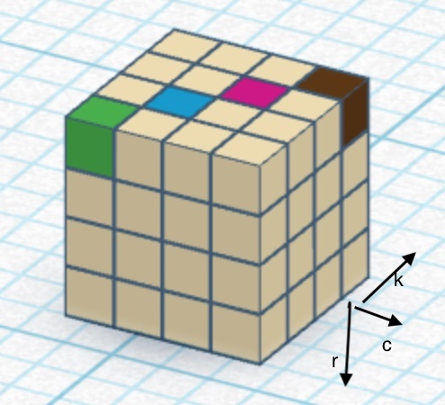
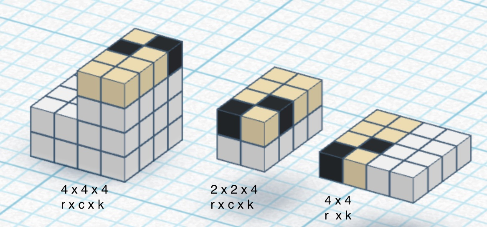

# Sudoku AI Tutorial – Solving Sudoku with Tensors and Optimization





This repository is a step-by-step educational project that demonstrates how a Sudoku puzzle can be formulated and solved as a **continuous optimization problem** using PyTorch.

Instead of classic backtracking or rule-based solvers, Sudoku is modeled as a set of **differentiable constraints** operating on probability tensors.  
A gradient-based optimizer is then used to iteratively minimize constraint violations until a valid solution emerges.

The focus of this project is **understanding**, not performance.

---

## Core Idea

Each Sudoku cell is represented as a probability distribution over possible digits.  
All Sudoku rules (rows, columns, blocks, and given clues) are expressed as **loss functions** acting on these probabilities.

The optimizer gradually reshapes the probability tensor until:
- every row contains each digit exactly once
- every column contains each digit exactly once
- every block contains each digit exactly once
- all given cells are respected

In other words:  
> *Sudoku is solved by minimizing an energy landscape defined by its constraints.*

---

## Tutorial Structure

The tutorial is organized into three main parts.  
Each part builds directly on the previous one.

---

## Repository Structure

- `images/` – visual explanations used in the notebooks and README
- `source/` – helper functions and reusable components
- `*.ipynb` – tutorial notebooks in recommended reading order

---

## Quick Start

```bash
git clone https://github.com/Silverlode76/sudoku-ai-tutorial.git
cd sudoku-ai-tutorial
pip install -r requirements.txt
jupyter notebook

---

### 01 – Tensors, Probabilities, and Constraints (4×4 Sudoku)

This part introduces the **core tensor formulation**.

You will learn:
- how a Sudoku grid can be represented as a 3D tensor `(row, column, digit)`
- how logits and softmax create valid probability distributions
- how row, column, block, and given constraints are expressed using tensor operations
- how constraint violations affect the loss
- how hard constraints (givens) differ from soft structural constraints

To keep all tensor operations transparent and easy to inspect, this chapter uses a **4×4 Sudoku** with 2×2 blocks.

📄 Notebook / PDF:
- `01_sudoku_constraints_tensor_basics_4x4_EN.ipynb`
- `02_sudoku_optimization_4x4_EN.ipynb`
- `03_sudoku_optimization_9x9_EN.ipynb`

---

### 02 – Optimization with PyTorch

This part explains **how the constraints are enforced**.

You will learn:
- how multiple constraint losses are combined into a single objective
- why gradient-based optimization works for this formulation
- how the Adam optimizer updates the tensor representation
- the role of softmax temperature and temperature annealing
- how probabilities gradually sharpen into a discrete solution

At this stage, Sudoku is no longer solved by logic rules, but by **iterative optimization**.

---

### 03 – Scaling to 9×9 Sudoku

The final part generalizes the approach to a standard **9×9 Sudoku**.

You will learn:
- how tensor dimensions change when scaling up
- how block constraints generalize from 2×2 to 3×3 blocks
- which parts of the implementation scale naturally
- which challenges arise with larger grids and tighter constraints

This chapter highlights both the **strengths and limitations** of the optimization-based approach.

---

## Technologies Used

- Python
- PyTorch
- Tensor operations (softmax, masking, reshaping)
- Custom loss functions
- Adam optimizer

No neural networks are used — the focus is purely on tensors and optimization.

---

## Who Is This Tutorial For?

This tutorial is intended for:
- engineers and developers who want to deepen their understanding of tensors
- learners exploring PyTorch beyond standard neural network examples
- anyone interested in expressing discrete problems as differentiable systems

Basic familiarity with Python and linear algebra is helpful.  
No prior experience with Sudoku solvers or machine learning is required.

---

## Disclaimer

This project is designed for **educational purposes**.  
It is not intended to be a production-ready Sudoku solver.

The main goal is to develop intuition for:
- tensor-based representations
- constraint formulation
- optimization-driven reasoning

---

## License

MIT License
